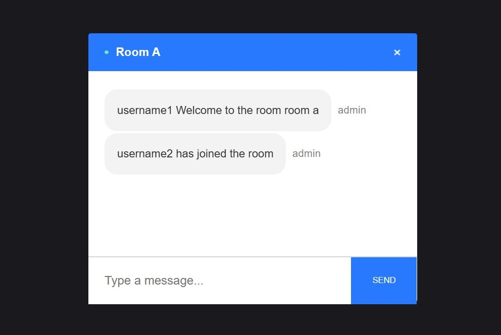
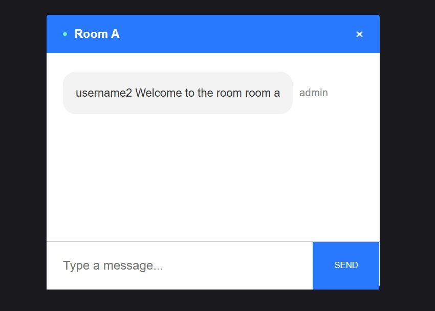
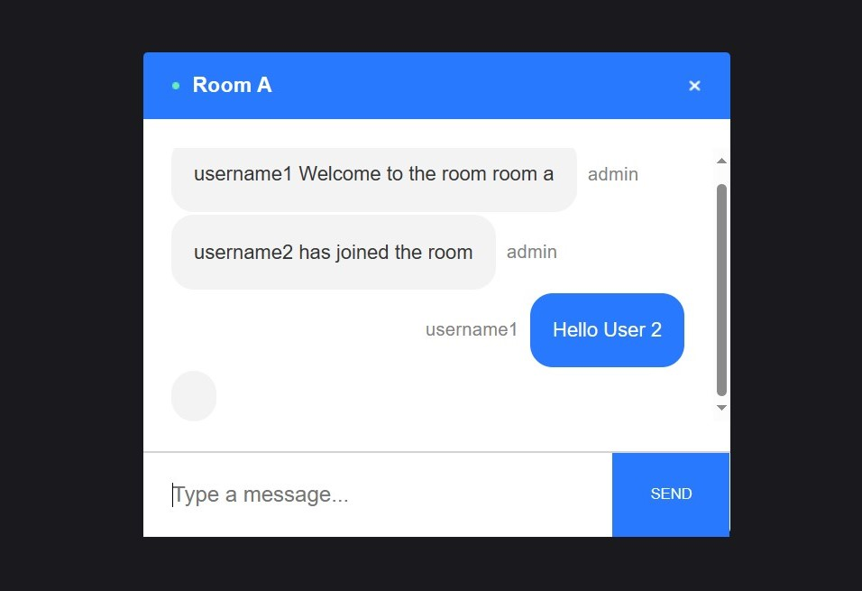
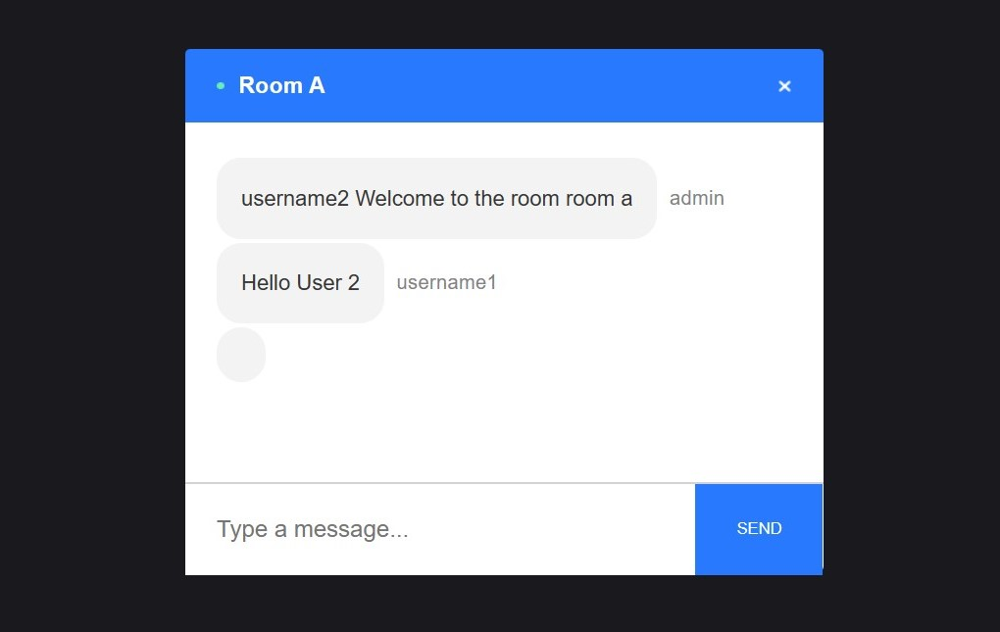
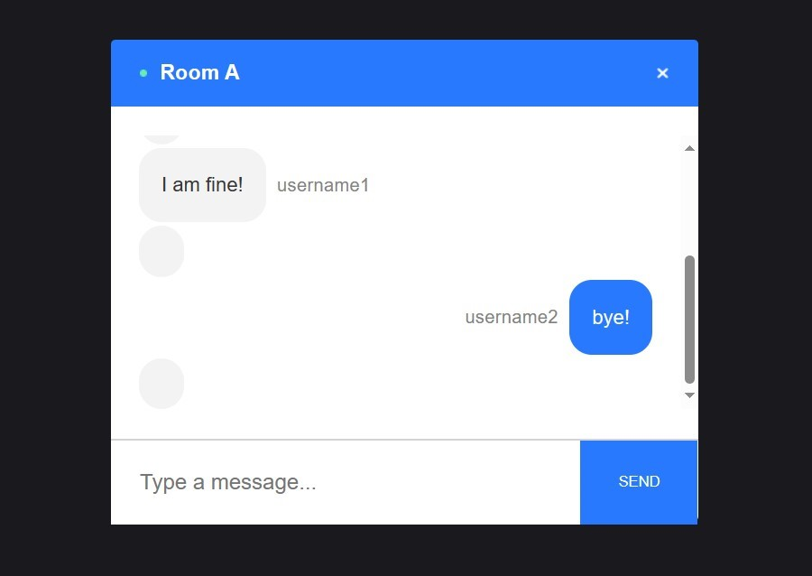
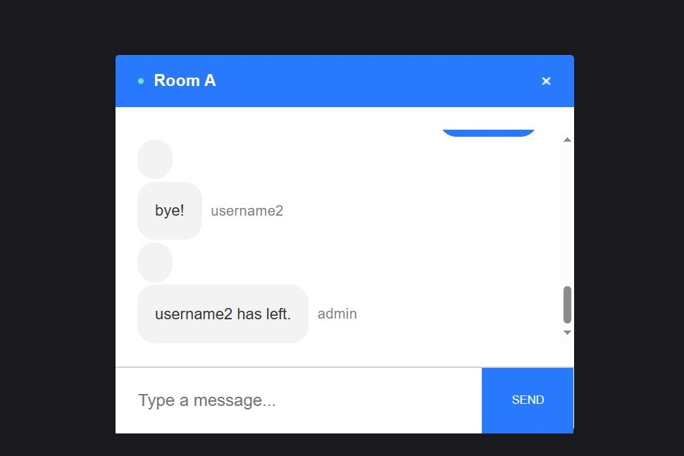

# Chat App

• Web App to join any room and chat with that room members within that room.

• Users can join any room by giving their Username and Room Name and chat there with other room members.

• This app has been created to implement the functionality of socket.io for real-time communication.
## Tech Stack

**Client:** Javascript, React Js, socket.io-client

**Server:** Node Js, Express Js, socket.io

## Screenshots
 User1 and User2 have joined Room A and they are chatting at realtime: 

 

